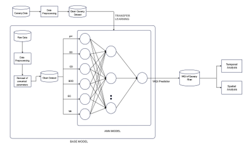
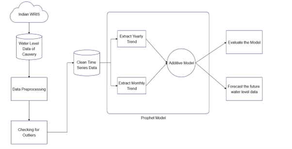
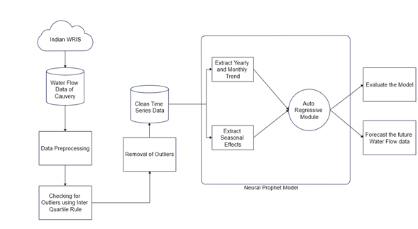

# Deep-Learning-Model-for-Analyzing-Water-Quality-Level-and-Flow-of-Cauvery-River-India
## SYSTEM ARCHITECTURE
The proposed Model comprises of three modules. They are
### 1.	CAUVERY RIVER WATER QUALITY ANALYSIS

Figure 1: Water Quality Analysis Architecture

#### Indian Water Quality Dataset
The dataset utilised in this module was gathered from various sites in India by the pollution control board. It comprised 1973 samples collected between 2005 and 2014 from various states of India. The parameters which determine quality of water considered were Dissolved Oxygen, pH, Fecal Coliform, Biological Oxygen Demand, Nitrate and Conductivity. The government of India collected this data to ensure that the given drinking water is of good quality. 

#### Cauvery Data
Cauvery river water quality data is also recorded by the PCB(Pollution Control Board). These data are measured at 20 different locations along the river Cauvery from 2007 to 2019. This data undergoes the pre-processing phase like the training dataset. Finally, the trained model will predict the WQI for this data and it will be temporally and spatially analysed.

#### Data Pre-processing
The processing phase is critical in data analytics for improving quality of the data. During this step, the WQI was derived using the dataset’s most significant parameters. Cleaning of data like handling missing values and normalizing also takes place during this phase. 

#### ANN Model
The ANN Model is created with three layers with input dimension of 6 and relu activation. The final layer has linear activation and gives the output dimension as 1. This model is compiled with Adam optimiser and the metrics used for training is Mean Squared Error. The number of epochs is set to 20 to avoid overfitting. The model is trained with Indian water quality data to develop the base model. The first two layers of the model are made untrainable and three more trainable layers are added. Finally it is trained using the Cauvery Data.
### 2. CAUVERY RIVER WATER LEVEL ANALYSIS AND FORECASTING

Figure 2: Water Level analysis and Forecast Architecture

#### Dataset
The water level data for Cauvery River is collected from a project called Indian WRIS. Indian WRIS delivers a wide range of hydrological data on rivers, lakes, wetlands, and reservoirs. It has about 200 stations where the river water data are collected on monthly basis. The Cauvery River water level time series data from 2007 to 2021 is available there.

#### Data Pre-processing 
The water level data is then processed for impurities or outliers. Outliers are data points that significantly differ from other data points. These values impose a threat to the model’s accuracy and it is important to take care of these values. Inter Quartile rule is used to check if there are any outliers. The data is converted into the form that can be used by the prophet Model.

#### Prophet Model
Prophet is an algorithm to forecast time-series data which is built based on an additive model and yearly, monthly, weekly and daily seasonality were used to fit nonlinear trends. It was developed by Facebook’s Core Data Science team. The model is trained using the cleansed dataset and is used to make prediction of future water level values. 

3.	 CAUVERY RIVER WATER FLOW ANALYSIS AND FORECASTING
   

Figure 3: Water Flow Analysis and Forecast Architecture

#### Dataset
The data to training the neural prophet model is collected from Indian WRIS (Water Resource Information System). The WRIS portal hast real time values of the water flow in each river within India. The monthly water flow data is available from 2007 to 2022. This portal can be used to collect information about the water resources in India. The data for Cauvery River is collected at 6 different stations namely Biligundulu, Kodumudi, Kollegal, Kudige, Musiri and Urachikottai. 

#### Data Pre-processing
The data collected from this portal contains lots of outliers, not in a standard format and has null values. The null values are removed and the outliers are identified using the Inter Quartile rule. Later, the outliers are removed and the columns are converted into standard format.

#### Neural Prophet
Neural Prophet is the advanced version of Prophet model which was developed by Facebook. This is also a time series forecasting algorithm. Neural Prophet is basically a prophet model that has been enhanced by using neural networks. The model is used to extract the trend and yearly seasonality of the water flow from the cleansed data. This model then predicts the future water flow values using the knowledge gained from the training dataset.

